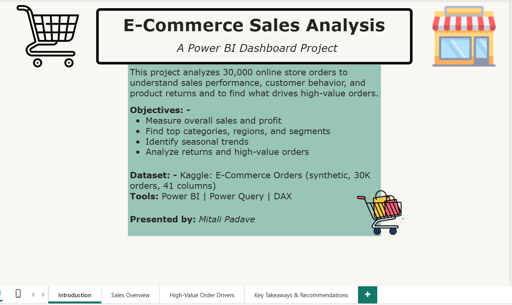
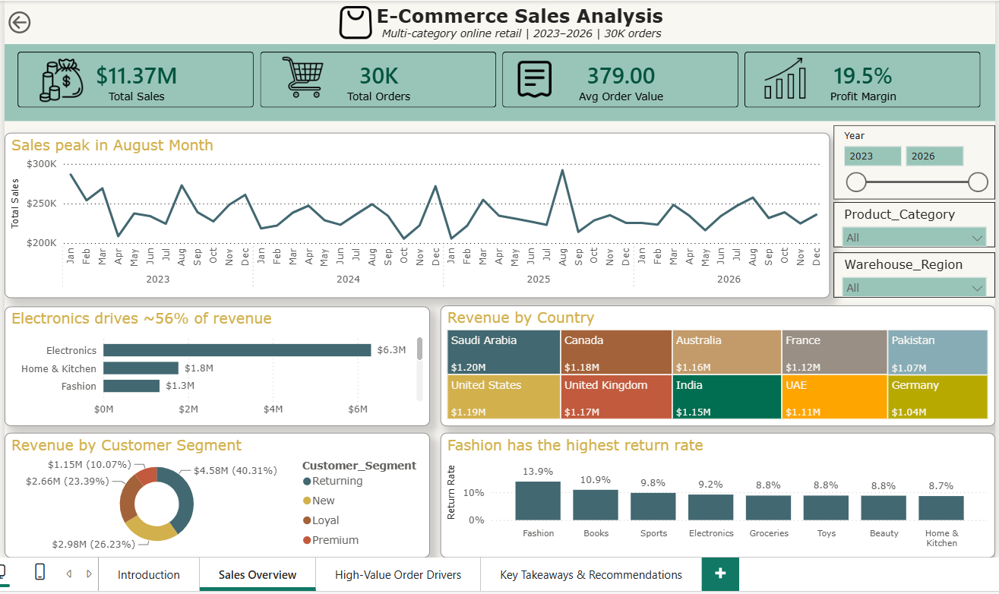
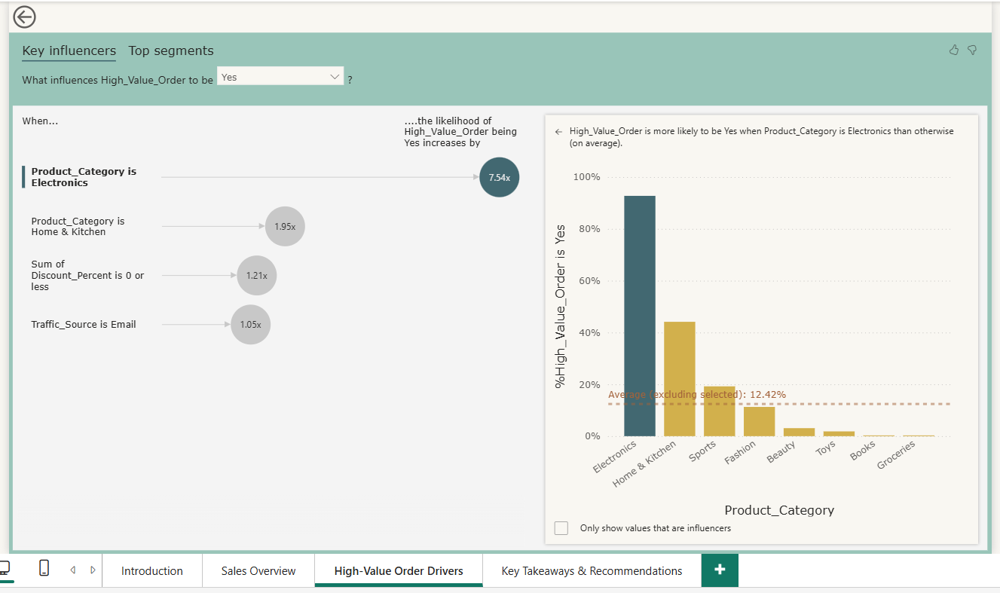
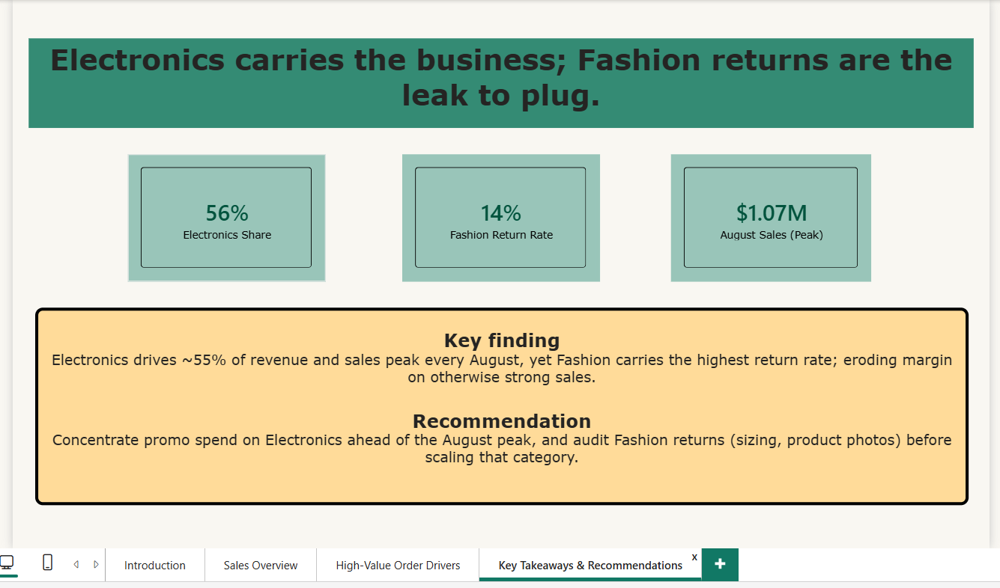

# E-Commerce Sales Analysis (Power BI)

A Power BI dashboard project that turns 30,000 online store orders into clear, useful insights about sales, customers, and returns.

## What this project is about

This is a sales analysis of a multi-category online store (electronics, fashion, home items, and more). I wanted to answer a few simple business questions:

- How is the business performing overall?
- Which products, countries, and customer types drive sales?
- Is there a seasonal pattern?
- Which products get returned the most?
- What makes an order high value?

## The dataset

- **Source:** Kaggle (E-Commerce Orders Dataset, synthetic)
- **Size:** 30,000 orders, 41 columns
- **Period:** 2023 to 2026
- **Grain:** One row = one order

The data is synthetic, which means it is computer generated but realistic. I chose it because it is recent and rich enough to cover sales, customer, and delivery analysis in one file.

## Tools used

- Power BI Desktop
- Power Query (for loading and checking the data)
- DAX (for measures and dynamic titles)

## How I built it

1. Loaded the data into Power Query and set the correct data types. The data was already clean, so I verified types and checked for empty values instead of heavy cleaning.
2. Built a date table so I could compare sales year over year.
3. Wrote DAX measures such as Total Sales, Total Profit, Profit Margin, Total Orders, Average Order Value, and Return Rate. I also added helper measures for the summary page (Electronics share, Fashion return rate, peak month sales) and a few dynamic-title measures.
4. Designed a four-page report:
   - **Introduction:** project goals, dataset, and tools
   - **Sales Overview:** KPIs, trend, category, country, segment, and returns, with slicers for year, product, and region
   - **High-Value Order Drivers:** a Key Influencers visual
   - **Key Takeaways and Recommendations:** the main finding, the recommendation, and summary cards
5. Added KPI cards with icons, slicers, and clear finding-based titles.

## Dashboard pages

### Introduction

### Sales Overview

### High-Value Order Drivers

### Key Takeaways and Recommendations

## Key insights

- Total sales of **11.37M** across 30,000 orders, with a **19.5% profit margin**.
- **Electronics** is the biggest category, close to half of all revenue.
- Sales **peak every August**, so that is the best month.
- **Fashion has the highest return rate**, which is a risk for profit.
- An Electronics order is about **7.5 times more likely** to be high value (found using the Key Influencers visual).
- **Returning customers** bring in around 40% of revenue.

## Recommendation

Focus marketing spend on Electronics ahead of the August peak, since it drives both revenue and high value orders. At the same time, look into why Fashion gets returned so often (sizing, photos, descriptions) before growing that category.

> In one line: Electronics carries the business, and Fashion returns are the leak to plug.

## What I would add next

- A star schema with separate customer and product tables
- Sales forecasting
- A delivery and logistics page using delivery days and returns

## About me

I am an aspiring data analyst who enjoys turning raw data into simple, clear stories. This is one of my early end-to-end Power BI projects, built from scratch.
